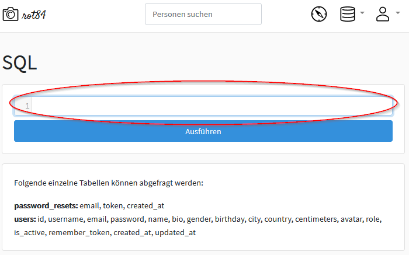
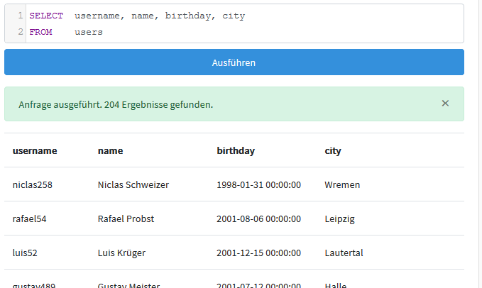

# Einfache SQL-Abfragen

## SQL kennen lernen

SQL (_structured query language_) ist eine Programmiersprache, mit der man auf Datenbanken zugreifen kann. SQL ist eine Vertreterin der so genannten **deklarativen Programmierung**, da man mit ihr nur das Ergebnis beschreibt, nicht aber den Weg dorthin. 

### Die erste SQL-Abfrage

1. _Rufen_ Sie Ihren InstaHub auf und melden Sie sich als `Admin` dort an!
   
1. Klicken oben rechts auf das Symbol *Datenbank* und wählen Sie ``SQL``:
   


3. Sie gelangen in den SQL-Editor:			



4. Setzen Sie den Cursor in das leere, im obigen Screenshot rot markierten, Eingabefeld und tippen Sie die folgende SQL-Abfrage exakt so ein:

   ```mysql
   SELECT  username, name, birthday, city 
   FROM    users	
   ```

   **Tipps:** Nach dem `SELECT` bzw. `FROM` tippen Sie die Tab-Taste, damit der Befehl übersichtlich aussieht. Am Ende der ersten Zeile können Sie `ENTER` drücken, um in eine neue Zeile zu wechseln. 

5. Klicken Sie auf `Ausführen`! Sie sehen nun eine Ergebnistabelle mit gut 200 Zeilen:



### Tipps:{-}

+ Beachten Sie, dass die Spaltennamen exakt mit den Bezeichnungen nach dem `SELECT`übereinstimmen!

+ SQL unterscheidet nicht zwischen Groß- und Kleinschreibung. Es ist aber üblich, die SQL-Befehle in GROSSBUCHSTABEN zu notieren. Halten Sie sich bitte an diese Gepflogenheit. 

+ Wenn Sie *alle* Spalten ausgeben wollen, können Sie statt alle Spalten aufzuzählen auch einfach ein ``*`` notieren, z. B.;   

  ```
  SELECT *
  FROM   users	
  ```

+   Wenn Sie statt einer Antwort wie der obigen eine englische Fehlermeldung bekommen, haben Sie bei der Eingabe des Befehls einen Fehler gemacht. Kontrollieren Sie noch einmal ganz genau, ob Sie irgendwo einen kleinen Fehler gemacht haben. Sind die Kommata wirklich da, wo sie sein sollen und sind es wirklich Kommata? Kein kleiner Tippfehler in den Spaltennamen?


## SQL-Abfragen verschönern und sortieren

Wenn Sie die Ergebnistabelle ausdrucken wollen, kann es hilfreich sein, die Spaltenbezeichnungen verändern zu können. _Probieren_ Sie aus, was passiert, wenn Sie statt `birthday` den Text `birthday AS "Geburtstag"`eintragen!

```mysql
SELECT	 username, name, birthday AS "Geburtstag", 
		 city AS "Stadt"
FROM	 users
ORDER BY birthday ASC
LIMIT    10
```

Mit der Klausel `ORDER BY` können Sie die Ausgabe sortieren lassen, mit `LIMIT` begrenzen Sie die Zahl der ausgegebenen Datensätze.

### Kommentare{-}

Beginnt eine Zeile beginnt mit zwei Minuszeichen (`--`),  wird diese vom SQL-Interpreter ignoriert:

```mysql
-- verschönerte Anfrage
SELECT	username, name, birthday AS "Geburtstag", 
		city AS "Stadt"
FROM	users
```

Man nennt solche ignorierten Zeilen *Kommentar*. Kommentare sind beim Programmieren wichtig, um zu erklären, was man gerade macht. Zum Beispiel kann man der Lehrkraft mitteilen, welche Aufgabe man bearbeitet. Das ist übrigens auch für Sie selbst hilfreich, wenn Sie (z. B. zur Klausurvorbereitung) noch einmal die alten Aufgaben herausholen.

Es gibt da nur ein Problem: InstaHub verarbeitet nur den ersten Befehl, den man in das SQL-Fenster eingibt. Kommentare sind Befehle. Daher wird der Kommentar "ausgeführt" und nicht die Abfrage.

Also: **Keine Kommentare im SQL-Fenster von InstaHub!**

Wenn Sie mehrere Zeilen als Kommentar markieren wollen, verwenden Sie `/*` und `*/`:

```sql
/* Verschoenerte Abfrage
   Liefert alle Nutzer*innen nach Geburtstag sortiert. */
SELECT   username, name, birthday AS "Geburtstag", 
         city AS "Stadt"
FROM     users
ORDER BY birthday ASC
LIMIT    10
```

### ORDER und LIMIT{-}

Statt `ASC` können Sie in der ORDER-Klausel auch `DESC` oder gar nichts verwenden. _Beschreiben_ Sie, was jeweils passiert!

_Beschreiben_ Sie, welche Bedeutung die `LIMIT`-Klausel hat!

#### Aufgabe 5.1: Erste SQL-Abfragen {-}

_Erstellen_ Sie jeweils eine SQL-Abfrage, die die folgenden verbalen Anfragen möglichst schön beantworten:

1. Wer sind die zehn jüngsten InstaHub-User\*Innen?
2. Wo wohnen die fünf am längsten angemeldeten InstaHub-User\*Innen?
3. Wer ist der erste InstaHub-User\*in gewesen?

## Dubletten aussortieren

Uns interessiert brennend, in welchen Städten wir bereits mindestens eine/n Nutzer\*In haben. Wir probieren es mit der folgenden Abfrage:

``` mysql
SELECT	 city
FROM 	 users
ORDER BY city ASC
```

Das Ergebnis ist eine lange Liste von Städten, in denen aber einige Städte mehrfach vorkommen.

Probieren Sie es einmal mit

```mysql
SELECT	 DISTINCT city
FROM 	 users
ORDER BY city ASC
```

Nun werden alle Zeilen aussortiert, die mehr als einmal vorkommen. 

#### Aufgabe 5.2: Dubletten aussortieren {-}

_Erstellen_ Sie jeweils eine SQL-Abfrage, die folgenden verbalen Anfragen möglichst schön beantworten:

1. Welche Körpergrößen haben unser Nutzer\*innen?
2. Welche verschiedenen Werte kommen in der Spalte `role` vor?

## Datensätze filtern

Welche InstaHub-Nutzer\*Innen leben eigentlich in Dresden?

Wir könnten nun die Liste nach Städten sortieren und dann scrollen, bis wie bei _Dresden_ angekommen sind. Das muss einfach gehen. Na klar. Die wohl wichtigste Klausel des `SELECT`-Befehls fehlt uns noch: `WHERE` 

``` mysql
SELECT  username, name, city
WHERE   city = "Dresden"
FROM    users
```

#### Aufgabe 5.3: Deutschlandreise I {-}

_Erstellen_ Sie jeweils eine SQL-Abfrage, die folgenden verbalen Anfragen möglichst schön beantworten:

1. Welche Nutzer\*Innen wohnen in Leipzig?
2. Welche Nutzer\*Innen haben die Rolle ``dba``?
3. Welche Nutzer*Innen wohnen in Bokholt-Hanredder?
4. Welche Nutzer*Innen wohnen in Hamburg?
5. Ist Justin Schuster bei uns angemeldet?

#### Aufgabe 5.4 Ups... {-}

_Überprüfen_ Sie Ihre Ergebnisse aus den beiden letzten Abfragen der vorangegangenen Aufgabe noch einmal genau und _begründen_ Sie, warum Ihre Ergebnisse offenbar nicht ganz korrekt sind!

### Zeichenketten vergleichen

Beim Vergleichen von Zeichenketten ist es oft hilfreich, wenn man nach Teilzeichenketten suchen kann. Hierfür hat SQL den Operator `LIKE`, der anders als `=` nicht die exakte Übereinstimmung erfordert, sondern mit Hilfe von Platzhalten (_Wildcards_) auch Wortteile finden kann. So würde `WHERE name LIKE "Justin%Schuster%"` auch die folgenden Personen finden, wenn Sie denn als Nutzer\*innen angemeldet wären:

+ Justine Schuster
+ Justin Frederik Augustus Frederikus Freiherr von Schuster-Boomzwickel

Während mit `%` beliebig viele Zeichen (inklusive keinem) gefunden werden, wird mit dem Zeichen `_` (Unterstrich, Shift+Minuszeichen) nur genau ein Zeichen gefunden.

#### Aufgabe 5.5 Deutschlandreise II {-}

_Erstellen_ Sie jeweils eine SQL-Abfrage, die folgenden verbalen Anfragen möglichst schön beantworten:

1. Welche Nutzer*Innen wohnen in Hamburg?
2. Welche Nutzer\*Innen mit dem Namen Schuster sind bei uns angemeldet?
3. Welche Nutzer*Innen mit dem haben wir, die so klingen wie Meier? (Hier können Sie einen Beifang irrelevanter Datensätze wohl nicht völlig verhindern!)

### Numerische Vergleiche

Mit den Vergleichsoperatoren `>`,  `>=`, `<` und `<=`können auch numerische Werte verglichen werden.

Das funktioniert auch mit Kalenderdaten. `WHERE created_at < "2017-12-31"` liefert alle Benutzer\*Innen, deren Datensätze vor dem 31.12.2017 erstellt wurden.

#### Aufgabe 5.6 Riesen und Zwerge {-}

_Erstellen_ Sie jeweils eine SQL-Abfrage, die folgenden verbalen Anfragen möglichst schön beantworten:

1. Welche InstaHub-Nutzer\*Innen sind größer als 188&nbsp;cm?
2. Welche InstaHub-Nutzer\*Innen sind kleiner als 155&nbsp;cm?
3. Welche InstaHub-Nutzer\*Innen sind heute am Tag der Aufgabenbearbeitung *nicht* volljährig?
4. Welche InstaHub-Nutzer*Innen sind älter als 70&nbsp;Jahre?
5. Gibt es eine/n Nutzer\*In, die am selben Tag Geburtstag hat wie Sie? (Hinweis: Wenn Sie am 12.10.1998 geboren sein sollten, suchen Sie, ob jemand am 12.10.1998 geboren ist!)

